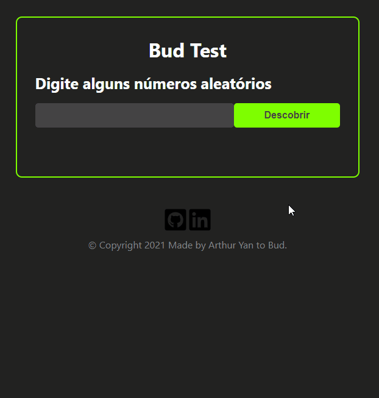

<h1 align="center">
    
</h1>

<br>

## 🧪 Tecnologias

Esse projeto foi desenvolvido com as seguintes tecnologias:

- [React](https://reactjs.org)
- [TypeScript](https://www.typescriptlang.org/)
- [Styled Components](https://styled-components.com)

## 💻 Como executar

Clone o projeto e acesse a pasta do mesmo.

```bash
$ git clone https://github.com/arthuryan08/Bud-Test
$ cd Bud-Test
```

Para iniciá-lo, siga os passos abaixo:

```bash
# Instalar as dependências
$ yarn

# Iniciar o projeto
$ yarn start
```

## 📝 Projeto

Teste prático proposto pela [Bud](https://www.getbud.co) referente à vaga de emprego pra Desenvolvedor React Júnior.
Desenvolvido do dia 10 ao dia 12 de Dezembro de 2021.

## 🚀 Demonstração

O projeto pode ser testado e executado clicando **[aqui](https://arthuryan08.github.io/Bud-Test/)**.
